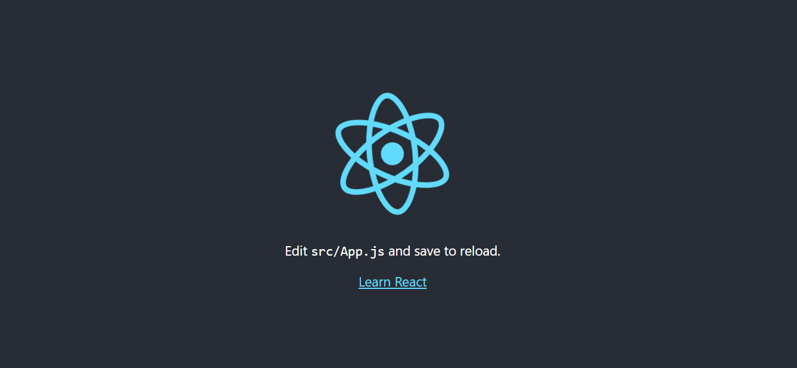
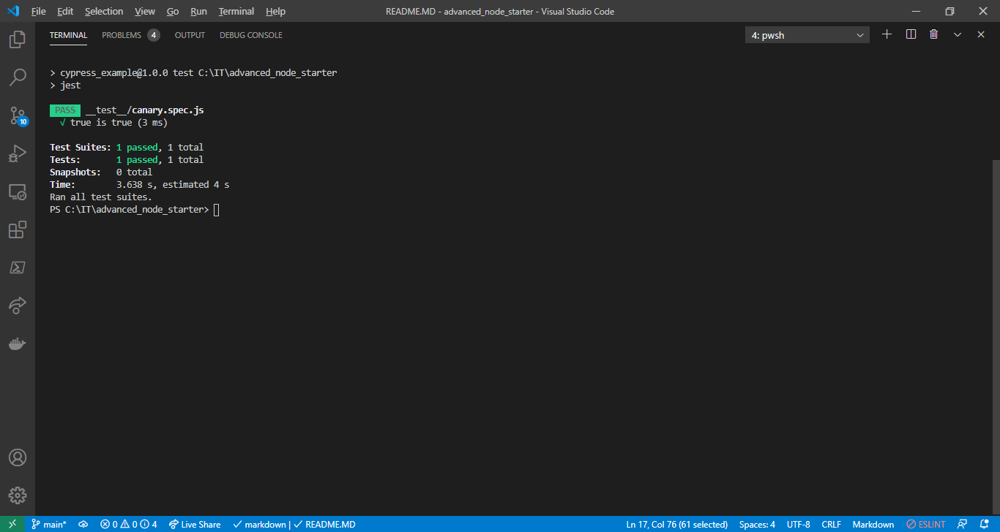
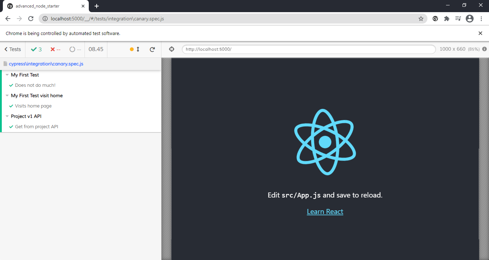

# Advanced Node Starter
## Purpose
The advanced node starter is intended to make writing javascript and node.js apps easier, by including a basic app skeleton and tools for development and testing. 

When the app is run, the site is available from http://localhost:5000

## Server - Node.js
+ Node.JS written in typescript

To run the server in dev mode. This will rebuild on each saved edit via nodemon.
To modify the nodemon files edit the nodemon.json file
``` 
npm run dev:be
```

To run the server standalone 
```
npm start
```

## Client - React

Client is React and source is kept in the client folder, the build folder is client_build.

```
npm run dev:fe
```

## Unit tests


Unit tests are done by running 
```
npm test
```

## Integration tests
### Cypress


Tests are stored within ./cypress/integration

Full cypress documentation https://www.cypress.io/

### Running Cypress
```
npm run cypress
```
